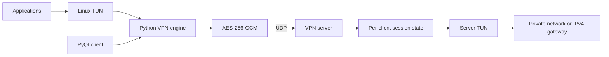

# MATF Master VPN

Research prototype of an IPv4 virtual private network implemented in Python for
security and performance analysis. The system uses Linux TUN interfaces, UDP
transport, authenticated encryption, an authenticated key exchange, and a PyQt
client.

> This repository contains an educational research prototype. It has not
> received an independent security audit and is not intended for production use.

## Architecture



An IPv4 packet read from TUN is framed, encrypted, and transmitted as one UDP
datagram. The receiver validates the session, replay window, authentication tag,
and assigned tunnel address before writing the plaintext packet to TUN.

## Features

- Linux IPv4 TUN data plane over UDP
- versioned binary packet format
- AES-256-GCM authenticated encryption
- independent directional traffic keys
- static and authenticated ephemeral X25519 key agreement
- forward-secret session establishment
- sliding replay protection
- packet-count traffic-key rotation
- encrypted keepalives and liveness-based reconnect
- point-to-point and authenticated multi-client server modes
- client source-address anti-spoofing
- strict JSON configuration and structured JSON logging
- PyQt connection manager
- local namespace and public-cloud integration tests
- reproducible latency, throughput, loss, CPU, and memory evaluation tools

## Repository layout

| Path | Purpose |
|---|---|
| `src/matf_vpn/` | VPN protocol, cryptography, data plane, server, GUI, and analysis code |
| `tests/` | Unit and loopback integration tests |
| `scripts/` | Namespace integration tests and benchmark automation |
| `examples/` | Configuration examples without deployment credentials |
| `docs/security-analysis.md` | Threat model, implemented controls, and residual risks |
| `docs/evaluation-methodology.md` | Experimental design and statistical methodology |
| `docs/final-evaluation-results.md` | Final performance results and interpretation |
| `docs/figures/final/` | Derived figures from the final campaign |

Deployment credentials and raw result artifacts are intentionally excluded from
version control through `deployment/` and `results/` ignore rules.

## Requirements

- Linux
- Python 3.8 or newer
- `/dev/net/tun`
- root privileges or suitable network capabilities
- `iproute2`
- `cryptography`
- PyQt5 for the graphical client
- `iperf3` for performance measurements
- SciPy and Matplotlib only for final statistical analysis

WireGuard and OpenVPN Community Edition are required only for comparative
experiments.

## Installation

```bash
python3 -m venv .venv
.venv/bin/python -m pip install --upgrade pip
.venv/bin/python -m pip install -e '.[gui,analysis]'
```

The source layout can also be used without installation by prefixing commands
with `PYTHONPATH=src`.

## Commands

| Command | Purpose |
|---|---|
| `matf-vpn` | Point-to-point endpoint |
| `matf-vpn-server` | Multi-client server |
| `matf-vpn-keygen` | X25519 identity generation |
| `matf-vpn-gui` | PyQt client |
| `matf-vpn-benchmark` | Repeated ping and iperf3 collection |
| `matf-vpn-report` | Comparison CSV generation |
| `matf-vpn-experiment` | Randomized campaign scheduling and block aggregation |
| `matf-vpn-resource-monitor` | Linux server CPU and memory sampling |
| `matf-vpn-resource-report` | Resource-block aggregation |
| `matf-vpn-final-analysis` | Statistical tests and figure generation |

Configuration schemas are represented by
[`examples/client.example.json`](examples/client.example.json) and
[`examples/server.example.json`](examples/server.example.json). Private keys
are generated locally and are never stored in the repository.

## Testing

Standard test suite:

```bash
QT_QPA_PLATFORM=offscreen PYTHONPATH=src \
  python3 -m unittest discover -s tests -v
```

Privileged Linux integration tests:

```bash
sudo modprobe tun
sudo bash scripts/test_namespace_tunnel.sh
sudo bash scripts/test_multi_client_tunnel.sh
sudo bash scripts/test_gui_tunnel.sh
```

The namespace tests use real kernel TUN interfaces, UDP sockets, routes, and
ICMP traffic. They do not mock the VPN data plane.

## Evaluation

The completed evaluation compares five modes over the same public path:

1. direct communication;
2. plaintext Python TUN/UDP tunnel;
3. encrypted Python VPN;
4. WireGuard;
5. OpenVPN Community Edition.

The campaign contains six balanced randomized rounds and 30 repetitions per
mode. It records RTT, TCP throughput, UDP effective goodput, jitter, packet
loss, server CPU, and server memory. Run-level and round-aware nonparametric
analyses are applied to the preserved raw artifacts.

The full design is documented in
[`docs/evaluation-methodology.md`](docs/evaluation-methodology.md). Results,
limitations, and figures are documented in
[`docs/final-evaluation-results.md`](docs/final-evaluation-results.md).

### Result summary

| Mode | RTT median | TCP mean | UDP effective goodput | UDP loss | Server CPU mean |
|---|---:|---:|---:|---:|---:|
| Direct | 33.1 ms | 22.91 Mbps | 18.08 Mbps | 0.00% | 0.64% |
| Plaintext Python | 35.3 ms | 23.42 Mbps | 19.44 Mbps | 2.80% | 4.92% |
| Encrypted Python | 33.7 ms | 19.62 Mbps | 17.58 Mbps | 12.09% | 5.81% |
| WireGuard | 32.7 ms | 24.48 Mbps | 19.43 Mbps | 0.00% | 3.18% |
| OpenVPN | 33.1 ms | 18.49 Mbps | 19.12 Mbps | 4.39% | 4.11% |

The encrypted prototype exhibited similar median RTT to the established VPNs,
but higher CPU use than WireGuard and substantial UDP loss at a 20 Mbps offered
rate. TCP ordering was not stable across all randomized rounds. The evaluation
is limited by a burstable cloud VM and temporal variation on the public Internet.

## Security scope

The prototype provides confidentiality, integrity, configured-peer
authentication, directional key separation, forward-secret session
establishment, replay resistance, and per-client tunnel-address isolation.

Known limitations include elevated process privileges, no independent protocol
audit, no handshake rate limiting, a bounded replay cache, IPv4-only operation,
visible transport metadata, and no production privilege separation. See
[`docs/security-analysis.md`](docs/security-analysis.md) for the full analysis.

## License

No license has been assigned. All rights are reserved unless a license is added
explicitly.
