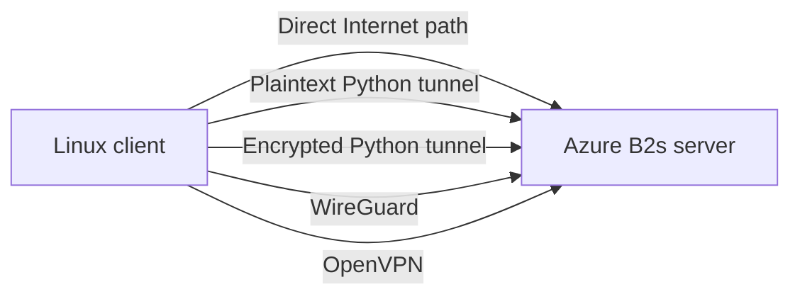

# Evaluation methodology

## Research questions

The evaluation examines:

1. the latency and throughput overhead of the Python TUN/UDP data plane;
2. the additional cost of authenticated encryption and replay protection;
3. the performance of the encrypted prototype relative to WireGuard and
   OpenVPN Community Edition;
4. server CPU and memory requirements across all evaluated modes.

## Experimental modes

Five modes are evaluated:

| Mode | Purpose |
|---|---|
| Direct | Public Internet baseline without a tunnel |
| Plaintext Python | Python, TUN, UDP, and framing overhead without encryption |
| Encrypted Python | Complete prototype with AES-256-GCM and authenticated X25519 |
| WireGuard | Established kernel-space VPN reference |
| OpenVPN | Established user-space VPN reference using AES-256-GCM over UDP |

The plaintext mode isolates implementation overhead from the security overhead
of the complete prototype.

## Topology

A physical Linux client and an Ubuntu `Standard_B2s` VM in Azure West Europe
form the two endpoints. All modes use the same client, server, home ISP, public
Internet path, and Azure region. Each VPN uses an independent tunnel subnet and
UDP transport port.

This topology captures realistic public-Internet behavior but does not remove
home-ISP variation or Azure burstable-VM effects. Those factors are treated as
threats to internal validity.

## Experimental design

The campaign uses a balanced randomized-block design:

- fixed pseudo-random seed: `20260823`;
- six rounds;
- each of the five modes appears once per round;
- five repetitions per mode and round;
- 30 repetitions per mode in total;
- no adjacent repetition of the same mode across round boundaries.

A short unrecorded warm-up precedes collection. The generated schedule is
stored with the result artifacts. Interrupted campaigns are resumed without
replacing completed blocks.

## Workload

Each repetition contains:

- 20 ICMP echo requests;
- one 10-second TCP `iperf3` transfer;
- one 10-second UDP `iperf3` transfer at a 20 Mbps offered rate;
- a two-second delay between throughput runs.

Server-wide CPU and memory are sampled from Linux `/proc` once per second for
the duration of every randomized block. Whole-system resource measurements are
used because WireGuard executes primarily in kernel space while the Python
prototype and OpenVPN execute in user space.

## Metrics

The collected metrics are:

- RTT mean, median, p95, standard deviation, and ICMP loss;
- TCP throughput;
- UDP sender rate, receiver loss, effective goodput, jitter, and loss;
- server CPU mean and p95;
- server memory mean and p95;
- failed and retried measurement attempts.

UDP effective goodput is calculated as:

$$
G_{\mathrm{UDP}} = R_{\mathrm{sender}}\left(1 - \frac{L}{100}\right),
$$

where $R_{\mathrm{sender}}$ is the reported sender bitrate and $L$ is receiver
packet loss in percent.

## Statistical analysis

One benchmark repetition is the statistical unit for RTT and throughput
($n=30$ per mode). One randomized round is the blocked unit for server CPU and
memory ($n=6$ per mode). Individual ICMP packets and one-second resource samples
are not treated as independent experimental repetitions.

The analysis includes:

- descriptive statistics and box plots;
- Kruskal-Wallis omnibus tests across modes;
- Mann-Whitney U pairwise tests with Holm correction at run level;
- Friedman tests over six round-level aggregates;
- exploratory Wilcoxon pairwise tests with Holm correction at round level;
- rank-biserial effect sizes for run-level pairwise comparisons.

Absolute and percentage differences accompany significance tests. The
round-aware analysis is emphasized where temporal variation may affect the
result.

## Reproducibility and integrity

The campaign preserves:

- the randomized schedule and seed;
- raw JSON for every benchmark block;
- raw server resource samples for every block;
- merged per-mode documents;
- all retry events and error messages;
- software, kernel, VM, and parameter metadata;
- a generated comparison CSV and statistical-analysis JSON.

A valid campaign requires six benchmark and six resource blocks for each mode,
identical measurement parameters except for the intended target address, and 30
completed TCP and UDP runs per mode. Outliers are retained unless an exclusion
rule is defined before collection.

## Limitations

The final setup has the following limitations:

- the Azure B2s server is burstable;
- the public Internet and home ISP introduce temporal variation;
- client and server tool versions differ;
- VPN implementations use different cryptographic and data-plane architectures;
- resource values measure the whole server while all endpoints remain active;
- the study covers one Azure region, one server size, IPv4, and one client OS;
- data-plane RTT excludes handshake establishment time.

Randomized blocks distribute temporal effects across modes but cannot eliminate
these limitations. Results therefore characterize this deployment and workload
rather than universal protocol performance.
