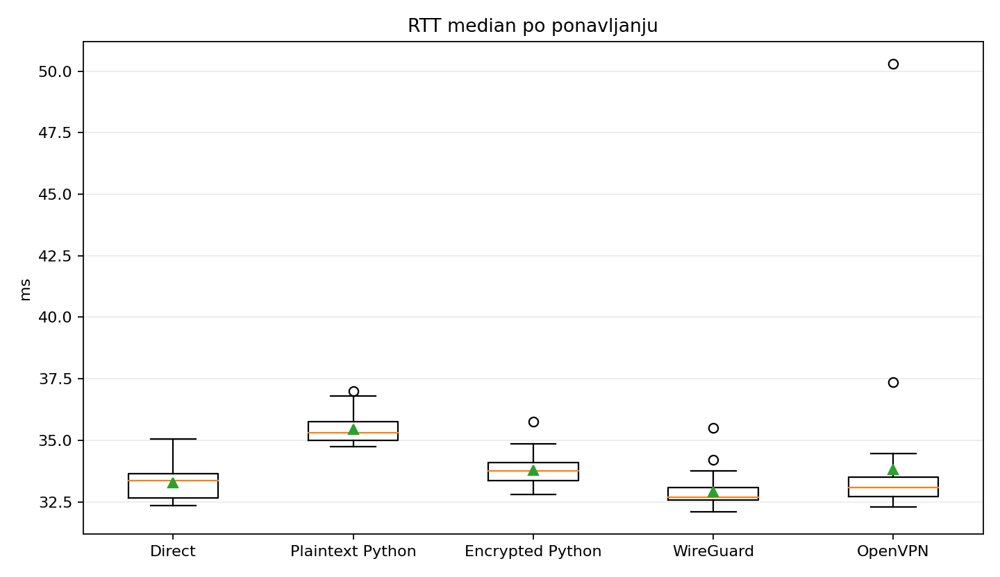
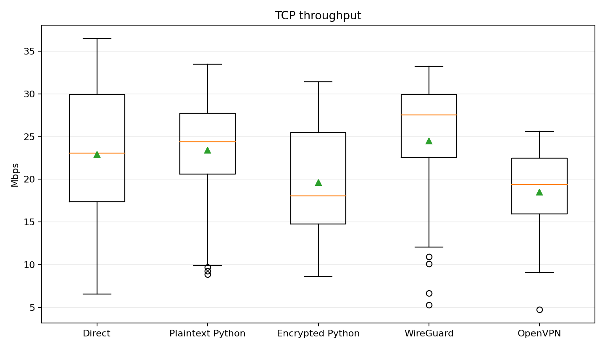
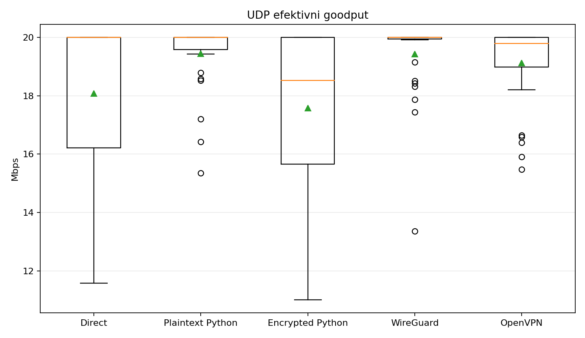
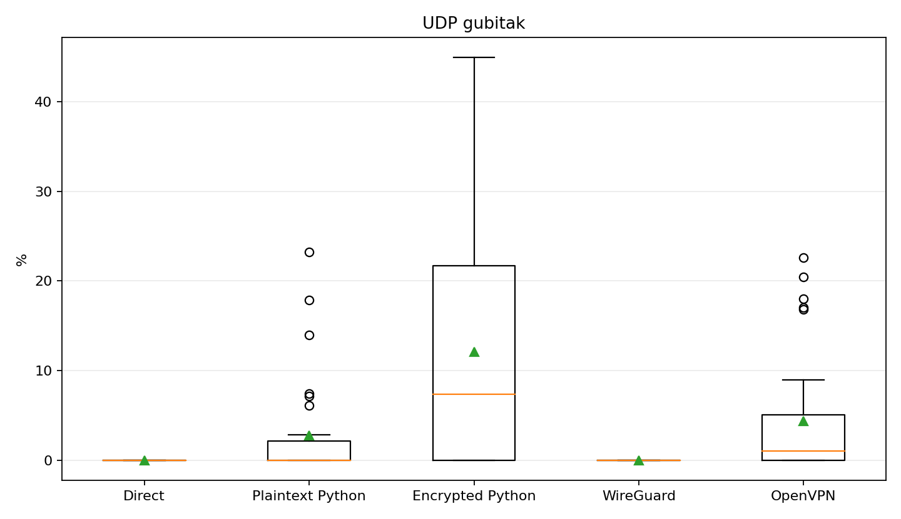
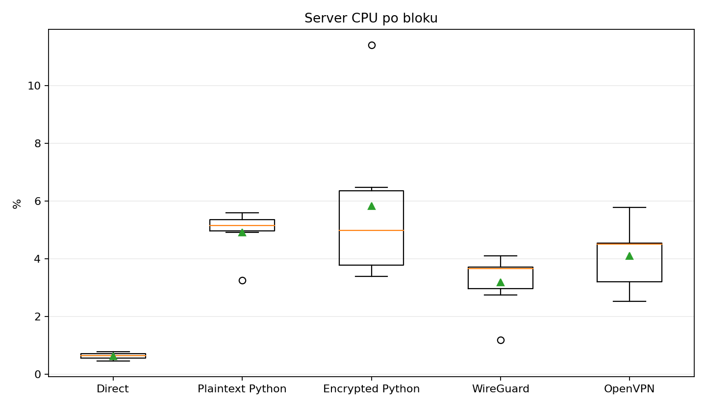

# Rezultati finalne evaluacije performansi

## 1. Eksperimentalno okruzenje

| Stavka | Vrednost |
|---|---|
| Datum | 23. avgust 2026. |
| Klijent | Lokalni fizicki Linux racunar |
| Server | Azure `Standard_B2s`, West Europe, Ubuntu 24.04 LTS |
| Server public/private IP | `AZURE_PUBLIC_IP` / `AZURE_PRIVATE_IP` |
| Client kernel | `5.15.0-139-generic` |
| Server kernel | `6.17.0-1022-azure` |
| Client/server Python | 3.8.10 / 3.12.3 |
| Client/server cryptography | 2.8 / 50.0.0 |
| Client/server iperf3 | 3.7 / 3.16 |
| Client/server WireGuard tools | 1.0.20200513 / 1.0.20210914 |
| Client/server OpenVPN | 2.4.12 / 2.6.19 |
| Repo commit tokom campaign-a | client `c90a5a5`, server `191bd95` |
| Random seed | `20260823` |
| Rundi | 6 |
| Ponavljanja po rundi i rezimu | 5 |
| Ukupno po rezimu | 30 |
| ICMP zahteva po ponavljanju | 20 |
| TCP/UDP trajanje | 10 s |
| UDP offered rate | 20 Mbps |

Korisceni su direct javni Azure put, plaintext Python tunel, encrypted Python
VPN, WireGuard i OpenVPN. Svaki rezim pojavio se jednom u svakoj randomizovanoj
rundi. Svi VPN endpoint-i bili su dostupni tokom campaign-a, dok je samo izabrani
rezim aktivno opterecivan.

## 2. Integritet skupa podataka

| Rezim | ICMP primljeno | ICMP loss | TCP run | UDP run | Uspesno retry-ovan iperf pokusaj |
|---|---:|---:|---:|---:|---:|
| Direct | 597/600 | 0.500% | 30 | 30 | 0 |
| Plaintext Python | 600/600 | 0.000% | 30 | 30 | 1 |
| Encrypted Python | 600/600 | 0.000% | 30 | 30 | 0 |
| WireGuard | 600/600 | 0.000% | 30 | 30 | 0 |
| OpenVPN | 599/600 | 0.167% | 30 | 30 | 1 |

Dva retry slucaja bila su `iperf3` UDP control-channel reset-i. Ponovljeni
pokusaji su zavrseni uspesno i oba dogadjaja su sacuvana u raw JSON-u; nisu
izgubljeni niti zamenjeni validni merni rezultati.

## 3. Glavni rezultati

`RTT p95` u ovoj tabeli je p95 svih primljenih ICMP uzoraka. Statisticki test RTT
razlika koristi median 20 ICMP uzoraka svakog od 30 ponavljanja, da pojedinacni
paketi ne bi bili tretirani kao nezavisne eksperimentalne jedinice.

| Rezim | RTT median | RTT p95 | TCP mean | UDP efektivni goodput | UDP jitter | UDP loss | Server CPU mean | CPU p95 | RAM mean |
|---|---:|---:|---:|---:|---:|---:|---:|---:|---:|
| Direct | 33.1 ms | 72.84 ms | 22.91 Mbps | 18.08 Mbps | 1.16 ms | 0.00% | 0.64% | 2.03% | 565.08 MiB |
| Plaintext Python | 35.3 ms | 51.82 ms | 23.42 Mbps | 19.44 Mbps | 0.85 ms | 2.80% | 4.92% | 20.00% | 568.29 MiB |
| Encrypted Python | 33.7 ms | 55.86 ms | 19.62 Mbps | 17.58 Mbps | 1.51 ms | 12.09% | 5.81% | 22.66% | 573.51 MiB |
| WireGuard | 32.7 ms | 47.11 ms | 24.48 Mbps | 19.43 Mbps | 0.89 ms | 0.00% | 3.18% | 16.47% | 566.83 MiB |
| OpenVPN | 33.1 ms | 55.84 ms | 18.49 Mbps | 19.12 Mbps | 0.93 ms | 4.39% | 4.11% | 19.31% | 564.76 MiB |

UDP `bits_per_second` iz `iperf3` predstavlja ponudjeni/sender rate, pa je za
poredjenje prikazan loss-adjusted efektivni goodput.

## 4. Implementacioni i bezbednosni overhead

### Plaintext Python u odnosu na direct

Plaintext tunel je imao slican TCP mean (`+2.2%`) ali znatno visi server CPU
(`4.92%` naspram `0.64%`). To pokazuje cenu Python/TUN/UDP user-space data
plane-a i kada enkripcija nije ukljucena. RTT median je bio 2.2 ms visi.

### Encrypted u odnosu na plaintext Python

Ukljucivanje bezbednosnih mehanizama povezano je sa:

- `16.2%` nizim TCP mean throughput-om (`19.62` prema `23.42 Mbps`);
- `18.2%` visim server CPU mean (`5.81%` prema `4.92%`);
- oko `5.2 MiB` vise srednje server memorije;
- `9.29` procentnih poena visim prosecnim UDP loss-om;
- `9.6%` nizim UDP efektivnim goodput-om.

Encrypted RTT median je bio nizi od plaintext vrednosti. To se ne tumaci kao da
enkripcija ubrzava tunel, vec kao posledica mrezne/vremenske varijacije i B2s
stanja tokom razlicitih randomizovanih blokova.

## 5. Poredjenje VPN resenja

### Encrypted Python i WireGuard

WireGuard je deskriptivno imao:

- `3.1%` nizi RTT median;
- `19.9%` visi TCP mean throughput;
- encrypted Python CPU mean bio je `2.63` procentna poena, odnosno `82.6%`,
  visi od WireGuard CPU mean-a;
- 0% UDP loss, naspram 12.09% kod encrypted Python-a;
- oko 9.5% visi UDP efektivni goodput.

### Encrypted Python i OpenVPN

Encrypted Python je imao `6.1%` visi TCP mean od OpenVPN-a, ali i `1.70`
procentnih poena visi server CPU mean. OpenVPN je imao znatno manji UDP loss
(4.39% prema 12.09%) i veci efektivni UDP goodput.

## 6. Statisticka analiza

Jedno benchmark ponavljanje je statisticka jedinica za RTT/TCP/UDP (`n=30` po
rezimu). Jedna randomizovana runda/blok je jedinica za CPU/RAM (`n=6`). Primarni
omnibus test je Kruskal-Wallis. Dodatno je koriscen Friedman test nad 6
round-level agregata. Parna run-level poredjenja koriste Mann-Whitney U uz Holm
korekciju.

| Metrika | Kruskal-Wallis p | Friedman round-aware p | Zakljucak |
|---|---:|---:|---|
| RTT median po ponavljanju | <0.001 | 0.0008 | Razlike postoje i nakon blokiranja po rundi |
| TCP throughput | 0.0011 | 0.1627 | Run-level razlike postoje, ali rang nije stabilan kroz 6 rundi |
| UDP efektivni goodput | <0.001 | 0.0206 | Razlike postoje i kroz randomizovane runde |
| UDP jitter | 0.0635 | 0.2805 | Nema dokaza o razlici na nivou 0.05 |
| UDP loss | <0.001 | 0.0078 | Razlike postoje i kroz randomizovane runde |
| Server CPU | 0.0011 | 0.0011 | Rezim utice na server CPU |
| Server RAM | 0.1531 | 0.2093 | Nema dokaza o razlici |

Round-aware parna Wilcoxon poredjenja nemaju Holm-znacajne parove zbog samo 6
rundi i ogranicene snage. Zato se pojedinacni rangovi throughput-a predstavljaju
kao deskriptivni rezultati, ne kao definitivna tvrdnja da je jedan VPN brzi.

## 7. UDP gubitak i vremenski trend

UDP loss nije posledica samo jednog outlier-a:

- encrypted Python median loss bio je `7.35%`, loss se javio u 17/30 run-ova;
- OpenVPN median `1.01%`, loss u 20/30 run-ova;
- plaintext median `0%`, loss u 10/30 run-ova;
- direct i WireGuard imali su 0% u svih 30 run-ova.

Kod user-space tunela loss se povecao u rundama 4-5, a kod encrypted Python-a
ostao visok i u rundi 6. B2s je burstable i CPU credit stanje nije direktno
zabelezeno, pa rezultat moze predstavljati kombinaciju user-space packet-rate
ogranicenja i vremenskog/B2s throttling efekta. Randomizacija ga raspodeljuje,
ali ne uklanja. Ovaj nalaz je vazan prakticni rezultat i ogranicenje evaluacije.

## 8. Validnost i ogranicenja

Prednosti dizajna:

- isti lokalni client, Azure server i javni path za svih 5 rezima;
- 30 ponavljanja po rezimu;
- unapred fiksiran i sacuvan randomizovani raspored;
- isti `iperf3` parametri i UDP offered rate;
- raw blokovi, retry dogadjaji i server resource uzorci su sacuvani;
- plaintext referenca odvaja Python data-plane od bezbednosnog overhead-a.

Ogranicenja:

- B2s server je burstable;
- kucni ISP i javni Internet dodaju vremensku varijaciju;
- client/server verzije `iperf3`, OpenVPN i WireGuard alata nisu iste;
- protokoli koriste razlicite data-plane arhitekture i cipher-e;
- server CPU/RAM su whole-system vrednosti dok su svi endpoint-i bili aktivni;
- test pokriva jedan region, jednu VM velicinu, IPv4 i jedan client OS;
- handshake latency nije ukljucen u data-plane RTT.

## 9. Zakljucak

Prototip je funkcionalno kompletan i u realnom Azure deployment-u obezbedjuje
sifrovani private i full-tunnel saobracaj. Latency median svih VPN rezima bio je
blizak (32.7-35.3 ms). Encrypted Python TCP throughput bio je izmedju WireGuard-a
i OpenVPN-a deskriptivno, ali round-aware test ne podrzava stabilno rangiranje
TCP performansi. Najjasniji nedostatak prototipa je UDP loss pri 20 Mbps i veca
CPU potrosnja u odnosu na WireGuard. RAM razlike nisu bile statisticki znacajne.

Rezultati pokazuju da je Python resenje pogodno kao istrazivacki VPN prototip i
za analizu bezbednosno-performansnog kompromisa, ali ne kao zamena za produkcioni
WireGuard. Najvredniji naredni rad bio bi ponavljanje na fixed-performance VM,
profilisanje UDP receive/send putanje i batch/asynchronous obrada paketa.

Detaljni raw/statisticki artefakti nalaze se lokalno u `results/final`; generisani
izvestaj i grafikoni su u `results/final/analysis`.
